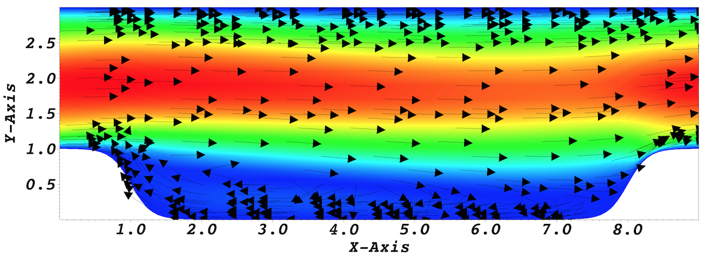

.. _1cyl:

-------------------
Flow past a circular cylinder
-------------------

This tutorial will describe how to run a case from scratch. 
We illustrate this procedure through a relatively simple example involving incompressible laminar flow in a two-dimensional periodic hill domain.  Our implementation is loosely based on the case presented by Mellen et al. [Mellen2000]_. A thorough review
for this case can be found in the `ERCOFTAC <http://qnet-ercoftac.cfms.org.uk/w/index.php/Abstr:2D_Periodic_Hill_Flow>`_ knowledge base wiki.  

..........................
Pre-processing
..........................

We assume that you have installed Nek5000 in your home directory. 
This tutorial requires that you have the tools ``genbox`` and ``genmap`` compiled. 
Make sure ``$HOME/Nek5000/bin`` is in your search PATH. 

Cases are setup in Nek5000 by editing case files. Users should select an editor of choice with which to do this (e.g vi). A case being simulated involves data for mesh, parameters, etc. As a first step, the user should create a case directory in their run directory.

.. code-block:: none

   cd $HOME/Nek5000/run 
   mkdir hillp
   cd hillp

.. code-block:: ini

    [GENERAL]
    stopAt = endTime
    endTime  = 200
    variableDT = yes
    targetCFL = 0.4
    timeStepper = bdf2

    [PRESSURE]
    residualTol = 1e-5

    [VELOCITY]
    residualTol = 1e-8

In choosing ``viscosity = -100`` we are actually setting the Reynolds number. This assumes that
:math:`\rho \times u_b \times h = 1` where :math:`u_b` denotes the bulk velocity and :math:`h` the hill height.  

We have set the calculation to stop at the physical time of :math:`T=200` (``endTime=200``) which is roughly 22 flow-thru time units (based on the bulk velocity :math:`u_b` and length of periodic pitch, :math:`L=9`).  Additional details on the names of keys in the ``.par`` file can be found :ref:`here <case_files_par>`. 

..........................
SIZE file 
..........................

The static memory layout of Nek5000 requires the user to set some solver parameters through a so called ``SIZE`` file.
Typically it's a good idea to start from our template.
Copy the ``SIZE.template`` file from the core directory and rename it ``SIZE`` in the working directory:

.. code-block:: none

   cp $HOME/Nek5000/core/SIZE.template SIZE

Then, adjust the following parameters in the BASIC section  

.. code-block:: fortran

      ...    
 
      ! BASIC
      parameter (ldim=2)
      parameter (lx1=8)
      parameter (lxd=12)
      parameter (lelg=22*8)
      parameter (lpmax=4)
      ...

For this tutorial we have set our polynomial order to be :math:`N=7` - this is defined in the ``SIZE`` file above as ``lx1=8`` which indices that there are 8 points in each spatial dimension of every element.
Additional details on the parameters in the ``SIZE`` file are given :ref:`here <case_files_SIZE>`.   

..........................
Compilation 
..........................

With the ``hillp.usr``, and ``SIZE`` files created, we are now ready to compile::  

  makenek hillp

If all works properly, upon compilation the executable ``nek5000`` will be generated.

.........................
Running the case
.........................

First we need to run our domain paritioning tool

.. code-block:: bash

  genmap

On input specify ``hillp`` as your casename and press enter to use the default tolerance. This step will produce ``hillp.ma2`` which needs to be generated only once. 

Now you are all set, just run

.. code-block:: bash

  nekbmpi 1cyl 4

to launch an MPI jobs on your local machine using 4 ranks. The output will be redirected to ``logfile``.

...........................
Post-processing the results
...........................

Once execution is completed your directory should now contain multiple checkpoint files that look like this::

  hillp.f00001
  hillp.f00002
  ...

The preferred mode for data visualization and analysis with Nek5000 is
to use Visit/Paraview. One can use the script *visnek*, to be found in ``/scripts``. It is sufficent to run:: 

  visnek hillp

*(or the name of your session)* to obatain a file named ``hillp.nek5000`` which can be recognized in Visit/Paraview.

In the viewing window one can visualize the flow-field as depicted in
:numref:`fig:hill_flow`.

.. _fig:hill_flow:

    Steady-State flow field visualized in Visit/Paraview. Vectors represent velocity. Colors represent velocity magnitude. Note, velocity vectors are equal size and not scaled by magnitude.  
